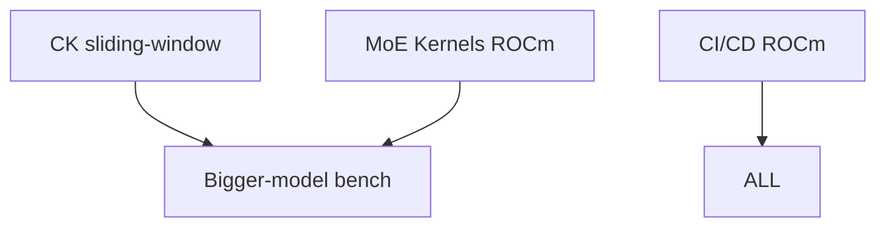

# ROCm Backend Improvements - PLAN/TODO

## Current State Summary (Updated)

| Component | Status | Notes |
|-----------|--------|-------|
| Core kernels (top-k, MoE router, MoE gemm, rotary, sort, graph) | ✅ Working | Built via `hipcc` from CUDA sources using candle's `rocm_compat` headers |
| CK FlashAttention (prefill) | ✅ Working | `src/rocm_ck_flash_attn` + `crate::rocm::ck_flash_attn`, BF16 only, head_dim 128/256 |
| Quantization (GPTQ, AWQ, HQQ, GGUF, bitsandbytes, FP8, MXFP4) | ✅ Mostly working | Via candle's ROCm kernels |
| LoRA / X-LoRA | ✅ Working | Shared CUDA→HIP compilation |
| **PagedAttention core (decode v1/v2, reshape_and_cache, gather_kv, copy/swap blocks)** | ✅ **Working** | Compiled via `hipcc` from CUDA kernels in `mistralrs-paged-attn/build.rs:250-352`. FP8 KV cache enabled via `-DENABLE_FP8` |
| **FlashInfer decode / FA3 / MLA / FlashAttn Sinks** | ❌ **CUDA-only** | Kernels excluded from ROCm build (need tensor cores RDNA lacks). Gated behind `#[cfg(all(feature = "cuda", target_family = "unix"))]` |
| **GDN FlashInfer SM90 prefill** | ❌ **CUDA-only** | `has_flashinfer_gdn_sm90_kernel` cfg |
| **Cutlass / DeepGEMM MoE** | ❌ **CUDA-only** | Marlin, CUTLASS, DeepGEMM backends |
| **FP8 kernels (blockwise, per-tensor, scalar in mistralrs-quant)** | ⚠️ **Partial** | PagedAttn FP8 works; quant-specific kernels in `mistralrs-quant/src/*fp8*/ops.rs` mostly CUDA-only |
| **Speculative decoding** | ❌ **CUDA-only** | dflash, FA3, etc. |
| **Device selection** | ✅ **Already worked** | `cuda_if_available(0)` works for ROCm via `cudarc-hip`; no change needed |

---

## Measured Baseline (2026-09-22, Radeon 8060S gfx1151, Qwen3-0.6B BF16)

`mistralrs bench auto -m Qwen/Qwen3-0.6B`, dev profile (`opt-level=3`):

| Config | TTFT | Decode TPOT |
|--------|------|-------------|
| BF16, batch 1, graphs on | 30.7ms (128 tok) / 75.7ms (1024 tok) | **10.88ms** |
| BF16, batch 1, graphs off (`MISTRALRS_CUDA_GRAPHS=0`) | 29.4ms | 12.26ms |
| Q8_0 ISQ | same | 10.88ms (no change) |
| Q4_K_M ISQ | 27.0ms | 11.58ms (**worse**) |
| BF16, batch 4 | 30.5ms | 10.81ms (no scaling) |
| CK prefill (`MRS_DEBUG_CK=1`) | HIT every layer | SKIP by design (seq_len=1) |
| Release binary, BF16 batch 1 | 30.26ms | **10.44ms** (~4% over dev — confirms overhead-dominated) |

Conclusions:
- Prefill is healthy: CK hits every layer, scales sublinearly (8x tokens -> 2.5x time).
- Decode is overhead-dominated, not bandwidth-bound: Q8 changes nothing, batch 4
  changes nothing, Q4 dequant overhead hurts. ~11ms/token is per-layer launch
  overhead + small-GEMM inefficiency across 28 layers.
- HIP graphs work and help (+12% decode), on by default.
- FlashInfer would not fix this bottleneck class (attention is a small fraction
  of decode at 0.6B); the bottleneck is launch overhead across all layers.

## High-Impact Additions (Priority Order, Revised Per Measurements)

### 1. CK Sliding-Window Support 🟡 **HIGH**
**Why:** Mistral/Mixtral never hit the fast prefill path (dispatch requires
`sliding_window.is_none()`). CK tile library supports masks; this is a
dispatch + kernel-instantiation job, no MFMA needed, works on RDNA.

**Location:** `mistralrs-core/src/attention/mod.rs` (dispatch),
`mistralrs-core/src/rocm_ck_flash_attn/` (kernel instantiations)

**Tasks:**
- [ ] Add sliding-window mask support to CK dispatch (extend `mask_type` handling)
- [ ] Generate CK kernel instantiations with windowed masks for head_dim 128/256
- [ ] Benchmark Mistral-7B prefill before/after on gfx1151

### 2. Bigger-Model Bench 🟡 **HIGH**
**Why:** At 0.6B decode is overhead-dominated; the profile shifts toward
memory-bound with larger models, where this stack is more competitive.
Validates whether optimization effort should target launch overhead vs bandwidth.

**Tasks:**
- [ ] Bench Qwen3-8B (or similar) BF16 on gfx1151, same matrix as above
- [ ] Compare TPOT scaling vs 0.6B to identify the crossover point

### 3. FlashInfer ROCm Integration ⚪ **DEPRIORITIZED**
**Why:** Not viable on gfx1151 (RDNA lacks MFMA; AMD fork targets gfx942/CDNA
only), no Rust bindings exist, ~2-3 weeks effort, and measurements show it
would not fix the actual decode bottleneck anyway. Revisit only for CDNA hardware.

**Status:** AMD fork has HIP kernels but requires CMake/jinja build system to generate config headers. Simple kernel copy failed - needs full build system integration.

**Proper Path (CDNA only):** Build AMD FlashInfer as shared library (`.so`) using their CMake, then create Rust FFI bindings.

**Location:** Multiple files

**Tasks:**
- [ ] Build AMD FlashInfer from source as shared library: `cd flashinfer && FLASHINFER_HIP_ARCHITECTURES=gfx942 python -m pip wheel . --wheel-dir=./dist/ --no-deps --no-build-isolation -v`
- [ ] Create `flashinfer-sys` Rust crate with `bindgen` bindings to the `.so`
- [ ] Create safe Rust wrapper crate matching current mistral.rs FFI signatures
- [ ] Update `mistralrs-paged-attn/build.rs` to link against system `flashinfer` library
- [ ] Remove `#[cfg(not(feature = "rocm"))]` guards in `mistralrs-paged-attn/src/cuda/mod.rs` and `ffi.rs`
- [ ] Update `mistralrs-core/src/flashinfer/mod.rs` cfgs to `#[cfg(any(feature = "cuda", feature = "rocm"))]`
- [ ] Update `mistralrs-core/src/paged_attention/layers/paged_attention.rs` to enable FlashInfer decode for ROCm

**Impact:** Enables FA3 decode, paged KV, MLA decode on AMD GPUs (MI300X/MI325X)
**Why:** Unlocks FA3 decode, paged KV, MLA decode on AMD. FlashInfer v0.2+ supports ROCm via HIP.

**Status:** AMD fork has HIP kernels but requires CMake/jinja build system to generate config headers. Simple kernel copy failed - needs full build system integration.

**Proper Path:** Build AMD FlashInfer as shared library (`.so`) using their CMake, then create Rust FFI bindings.

**Location:** Multiple files

**Tasks:**
- [ ] Build AMD FlashInfer from source as shared library: `cd flashinfer && FLASHINFER_HIP_ARCHITECTURES=gfx942 python -m pip wheel . --wheel-dir=./dist/ --no-deps --no-build-isolation -v`
- [ ] Create `flashinfer-sys` Rust crate with `bindgen` bindings to the `.so`
- [ ] Create safe Rust wrapper crate matching current mistral.rs FFI signatures
- [ ] Update `mistralrs-paged-attn/build.rs` to link against system `flashinfer` library
- [ ] Remove `#[cfg(not(feature = "rocm"))]` guards in `mistralrs-paged-attn/src/cuda/mod.rs` and `ffi.rs`
- [ ] Update `mistralrs-core/src/flashinfer/mod.rs` cfgs to `#[cfg(any(feature = "cuda", feature = "rocm"))]`
- [ ] Update `mistralrs-core/src/paged_attention/layers/paged_attention.rs` to enable FlashInfer decode for ROCm

**Impact:** Enables FA3 decode, paged KV, MLA decode on AMD GPUs (MI300X/MI325X)

---

### 4. FP8 / MXFP4 Kernels on ROCm ⚪ **DEPRIORITIZED for RDNA**
**Why:** MI300X has **native FP8 MMA** (2x BF16 throughput), but measurements on
gfx1151 show Q8 ISQ gives zero decode gain and Q4 is *slower* (dequant overhead
beats bandwidth savings; no FP8 tensor cores on RDNA). Only revisit for CDNA.
PagedAttn FP8 path works; quant-specific kernels don't.

**Location:** `mistralrs-quant/src/*fp8*/`, `mistralrs-quant/src/mxfp4/`

**Tasks:**
- [ ] Audit `mistralrs-quant/src/blockwise_fp8/ops.rs` - add ROCm HIP kernels
- [ ] Audit `mistralrs-quant/src/pertensor_fp8/ops.rs` - add ROCm HIP kernels
- [ ] Audit `mistralrs-quant/src/scalar_fp8/ops.rs` - add ROCm HIP kernels
- [ ] Audit `mistralrs-quant/src/mxfp4/ops.rs` - add ROCm HIP kernels (reference `metal_kernels` for Metal implementation)
- [ ] Use `candle-kernels` ROCm FP8 primitives where available
- [ ] Ensure `#[cfg(any(feature = "cuda", feature = "rocm"))]` guards on all kernels

---

### 3. MoE Kernels: Cutlass/DeepGEMM Alternatives for ROCm 🟡 **HIGH** (was #5)
**Why:** MoE models (Mixtral, Qwen3-MoE, DeepSeek) need expert routing + fused gemm. Current CUDA kernels use Cutlass/DeepGEMM.

**Location:** `mistralrs-quant/src/moe/`, `mistralrs-core/src/cuda/moe*.cu`

**Tasks:**
- [ ] Evaluate `hipblaslt` + `rocblas` for MoE gemm on ROCm
- [ ] Investigate AMD's **Composable Kernel (CK)** library for MoE operations
- [ ] Port `moe_gemm.cu` / `moe_gemm_wmma.cu` to use CK or hipBLASLt
- [ ] Add ROCm-specific MoE kernel selection in `mistralrs-quant/src/moe/mod.rs`
- [ ] Benchmark against CUDA Cutlass baseline

---

### 4. GDN FlashInfer SM90 Prefill for ROCm 🟢 **MEDIUM** (was #6)
**Location:** `mistralrs-core/src/cuda/gdn.rs`, `mistralrs-core/build.rs`

**Tasks:**
- [ ] Check if FlashInfer GDN kernel supports ROCm (likely not yet)
- [ ] If not, implement CK-based GDN prefill for ROCm (similar to CK FlashAttention)
- [ ] Update `has_flashinfer_gdn_sm90_kernel` cfg to support ROCm equivalent
- [ ] Add ROCm build path in `build.rs` for GDN kernels

---

### 5. Speculative Decoding on ROCm ⚪ **SKIPPED (2026-09-22)**
**Location:** `mistralrs-core/src/speculative/dflash.rs`, `mistralrs-core/src/speculative/paged_rows.rs`

Generic speculative driver/verifier already support ROCm (`any(cuda, rocm)`);
only dflash (block-diffusion draft method) is CUDA-gated. dflash custom kernels
are portable (plain CUDA, shims exist) but its attention core is doubly
FlashInfer-dependent (FA2 varlen-paged + FlashInfer KV layout) with no ROCm
equivalent — 3-6 weeks, high risk. Skipped: generic draft-model speculative
decoding covers the use case; revisit only with a DFlash draft model in hand.

---

### 6. CI/CD for ROCm 🟢 **MEDIUM** (was #8)
**Location:** `.github/workflows/`

**Tasks:**
- [ ] Add GitHub Actions job building with `--features rocm`
- [ ] Set up ROCm runner (self-hosted or use `rocm/actions` if available)
- [ ] Add test job running basic inference with ROCm
- [ ] Cache ROCm build artifacts
- [ ] Test matrix: gfx1100 (RDNA3), gfx1151 (RDNA3.5), gfx942 (CDNA3)

---

### 7. Documentation & Examples 🟢 **MEDIUM** (was #9)
**Location:** `docs/`, `examples/`

**Tasks:**
- [ ] Add ROCm build instructions to docs
- [ ] Document ROCm-specific environment variables (`CANDLE_ROCM_PATH`, `CANDLE_ROCM_ARCH`, `MISTRALRS_ROCM_COMPAT_INCLUDE`)
- [ ] Add ROCm example in `examples/` or `mistralrs/examples/`
- [ ] Document known limitations vs CUDA

---

## Completed ✅

| Task | Completed |
|------|-----------|
| PagedAttention core kernels (v1/v2 decode, reshape_and_cache, gather_kv, copy/swap blocks, FP8 KV) | ✅ Via `hipcc` in `mistralrs-paged-attn/build.rs:250-352` |
| CK FlashAttention (BF16 prefill) | ✅ `src/rocm_ck_flash_attn/` |

---

## Build Health ✅ (verified 2026-09-22)

| Configuration | Status |
|---------------|--------|
| CPU-only (`cargo check -p mistralrs --no-default-features`) | ✅ Passes |
| ROCm (`cargo check -p mistralrs --features rocm`) | ✅ Passes |
| ROCm binary (`cargo build -p mistralrs-cli --features rocm`) | ✅ Passes, bench runs on 8060S |

CPU fallback works with no GPU features: `mistralrs-paged-attn` is now a
required dependency of `mistralrs-core` (types always available, GPU kernels
still feature-gated), `indexed_copy` clamp is cfg-gated, and
`PAGED_ATTENTION_V2_PARTITION_SIZE` has a fallback const for non-CUDA/ROCm
builds (also fixes Metal-only builds).

## Proposed Optimizations (not yet implemented)

These were prototyped then reverted pending proper review/benchmarking:

| Optimization | Notes |
|--------------|-------|
| `__ldg()` for KV cache loads on ROCm | Guard with `#if defined(USE_ROCM)` only; do not reference `__CUDA_ARCH__` in HIP path, verify gfx macro (`__gfx11__` is likely never defined; HIP defines per-arch macros like `__gfx1100__`) |
| Async query load on RDNA | Needs a single dynamic-shared-memory declaration; `__builtin_memcpy` is synchronous, so measure before/after |
| PARTITION_SIZE 1024 for head_size 128 | Changes v2 grid shape; audit CUDA-graph partition math in `inputs_processor.rs` first, and keep CUDA on the existing path |

---

## Architecture Notes

### Current Build Approach (PagedAttention)
- **Core kernels**: CUDA `.cu` files compiled with `hipcc` via `build.rs` (lines 250-352)
- **Works because**: Kernels use basic warp shuffles, fp16/bf16 math - no CUDA-specific tensor core intrinsics
- **Enabled kernels**: v1/v2 paged attention, reshape_and_cache, copy_blocks, gather_kv, FP8 (`-DENABLE_FP8`)
- **Excluded kernels**: FlashInfer (ldmatrix/cp.async), FA3, MLA, FlashAttn Sinks (need tensor cores RDNA lacks)

### For ROCm-Native Optimization (Future)
- Consider separate `.hip`/`.cpp` sources using:
  - **CK (Composable Kernel)** - AMD's template library for GEMM/Attention
  - **rocBLAS / hipBLASLt** - BLAS libraries
  - **rocRAND / hipRAND** - Random number generation
- But current transpilation approach gets ~80% compatibility with minimal maintenance

### Feature Flag Organization
```toml
# In mistralrs-core/Cargo.toml, mistralrs-paged-attn/Cargo.toml, mistralrs-quant/Cargo.toml
features = [
    "cuda",      # NVIDIA CUDA
    "rocm",      # AMD ROCm (HIP)
    "metal",     # Apple Metal
    # ... other features
]
# All GPU features mutually exclusive at compile time for a given binary
```

---

## Dependencies Between Tasks



---

## Tracking

- **Target:** mistral.rs v0.x release with full ROCm parity for core inference
- **Milestone 1:** CPU fallback build (DONE) + measured baseline on gfx1151 (DONE)
- **Milestone 2:** CK sliding-window + bigger-model bench
- **Milestone 3:** MoE optimization + CI

---

## References

- [FlashInfer ROCm Support](https://github.com/flashinfer-ai/flashinfer)
- [AMD Composable Kernel (CK)](https://github.com/ROCm/composable_kernel)
- [candle-kernels ROCm](https://github.com/huggingface/candle/tree/main/candle-kernels)
- [hipBLASLt Documentation](https://rocm.docs.amd.com/projects/hipBLASLt/en/latest/)
- mistral.rs `mistralrs-paged-attn/build.rs` lines 250-352 (ROCm PagedAttention build)
- mistral.rs `src/rocm_ck_flash_attn/` (CK FlashAttention reference implementation)